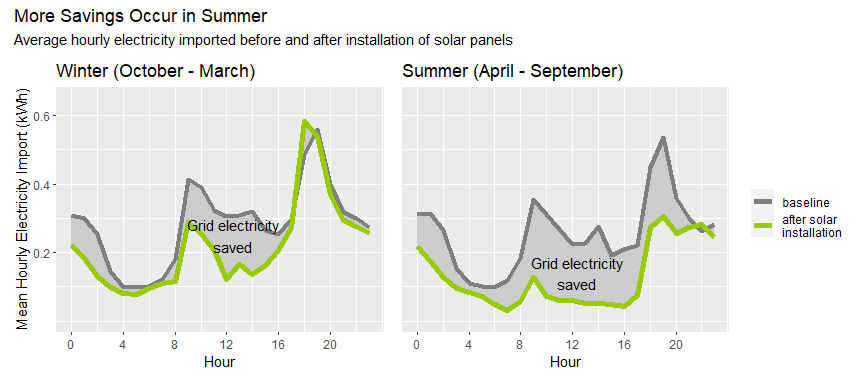

The Road to Carbon Zero - Starting at Home
================

- <a href="#1-data-sources" id="toc-1-data-sources">1 Data Sources</a>
- <a href="#2-baseline-energy-usage-and-carbon-equivalent"
  id="toc-2-baseline-energy-usage-and-carbon-equivalent">2 Baseline Energy
  Usage and Carbon Equivalent</a>
- <a href="#3-potential-carbon-savings"
  id="toc-3-potential-carbon-savings">3 Potential Carbon Savings</a>
  - <a href="#31-installation-of-solar-panels"
    id="toc-31-installation-of-solar-panels">3.1 Installation of Solar
    Panels</a>
  - <a href="#32-installation-of-an-air-source-heat-pump"
    id="toc-32-installation-of-an-air-source-heat-pump">3.2 Installation of
    an Air Source Heat Pump</a>
- <a href="#4-financial-considerations"
  id="toc-4-financial-considerations">4 Financial Considerations</a>
  - <a href="#41-solar-pv-installation"
    id="toc-41-solar-pv-installation">4.1 Solar PV installation</a>
  - <a href="#42-heat-pump-installation"
    id="toc-42-heat-pump-installation">4.2 Heat Pump Installation</a>
- <a href="#5-conclusions" id="toc-5-conclusions">5 Conclusions</a>

> It’s no secret we need to cut carbon emissions. Here I’m focusing on
> our household gas and electricity usage and ways to shrink our
> environmental footprint. In particular I’m looking at the impact of
> installing solar PV and an air source heat pump.

``` r
library(tidyverse)

library(patchwork)# for combining plots
library(knitr)    # for table display
```

------------------------------------------------------------------------

# 1 Data Sources

Data sources include the following:-

- Daily gas and electricity consumption data from our current energy
  supplier (EDF)
- [N3rgy](https://data.n3rgy.com/consumer/home) half hourly smart meter
  data (grid electricity usage)
- Solar PV yield data from Solis app
- Modeled solar yield from the [PVGIS tool from the European
  Commission](https://re.jrc.ec.europa.eu/pvg_tools/en/).
- CO<sub>2</sub> conversion factors for gas and electricity from
  gov.uk’s [2022 greenhouse gas reporting conversion
  factors](https://www.gov.uk/government/publications/greenhouse-gas-reporting-conversion-factors-2022)

``` r
# personal daily domestic usage and generation data
daily_data <- read_csv("Data/230630_daily.csv", 
                       col_types=cols(date = col_date(format="%d/%m/%y")))
# grid electricity usage aggregated by hour from N3rgy data and converted to local time
hrly_data <- read_csv("Data/230630_hourly.csv", 
            col_types=cols(local_time = col_datetime(format = "%Y-%m-%d %H:%M:%S")))

# tariff 1/7/23
PRICE_GAS_PER_KWH <- 0.07544 # previous price 0.10348 
PRICE_ELEC_PER_KWH <- 0.311 # import price, previous price 0.3476
PRICE_EXPORT_ELEC <- 0.15 # previous price 0.056
```

# 2 Baseline Energy Usage and Carbon Equivalent

We have a fairly typical 3-bed semi with a gas powered combi boiler.
Energy saving measures include double glazing, loft and cavity wall
insulation as well as keeping all use of the iron and hoover to an
absolute minimum - it’s for the planet:). Latest EPC rating is “B”.

Baseline gas usage was calculated by averaging the last 2 years of
consumption data from our energy supplier. Since we use gas for all our
heating needs this is strongly impacted by the weather so will vary year
to year.

Baseline electricity usage was taken as the 12 months of usage
immediately prior to a solar PV install.

``` r
# final date of available data
LAST_DATE <- max(daily_data$date)

# solar PV install
SOLAR_INSTALL_DATE <- date("2022-09-19")

# average annual gas usage based on last 2 years
baseline_gas_usage <- round(sum(daily_data$gas_usage_kwh[daily_data$date > LAST_DATE - 730])/2, -1)

# annual electricity usage from most recent full year pre solar PV install
baseline_elec_usage <- round(sum(daily_data$elec_usage_kwh[daily_data$date > 
        SOLAR_INSTALL_DATE - 365 & daily_data$date <= SOLAR_INSTALL_DATE]), -1)
```

Our energy usage is fairly low at 9270 kWh per year of gas and 2380 kWh
per year of electricity with roughly 10% variation year to year.

``` r
# carbon equivalent calculation using estimated conversion factors (kWh -> Kg CO2)
carbon_equivalent <- function(gas=0, grid_elec=0, GAS_TO_CARBON=0.18, GRID_ELEC_TO_CARBON=0.19){
  gas*GAS_TO_CARBON + grid_elec*GRID_ELEC_TO_CARBON
}
```

``` r
# baseline carbon dioxide equivalent with approx 10% variation in energy usage year to year
annual_carbon <- carbon_equivalent(gas=baseline_gas_usage, grid_elec=baseline_elec_usage)
carbon_baseline <- data.frame(
                      carbon=annual_carbon,
                      carbon_min=0.9*annual_carbon,
                      carbon_max=1.1*annual_carbon,
                      scenario="baseline")
```

> Baseline carbon cost of our domestic energy usage: 2120 kilograms
> carbon dioxide equivalent (Kg CO<sub>2</sub>e) each year.

# 3 Potential Carbon Savings

## 3.1 Installation of Solar Panels

### 3.1.1 Estimating annual yield

Solar PV was installed late September 2022 so as of July 2023 we have 9
full months of generation data. It is reasonable to expect far greater
solar generation in the sunnier half of the year so I’m going to have to
extrapolate carefully to estimate annual figures.

Here actual yield data is compared with modeled solar generation from
the [PVGIS tool from the European
Commission](https://re.jrc.ec.europa.eu/pvg_tools/en/). This includes
consideration for location, the size of PV array, azimuth and
inclination as well as solar radiation data for the years 2005 to 2020.

``` r
# modeled solar generation using PV GIS tool from the EC 
# using 2005-2020 solar radiation data
modelled_yield_by_mth <- read.csv("Data/PVGIS_solar_estimate_mthly.csv")
ANNUAL_YIELD <- 3423 # predicted average solar yield (kWh)
ANNUAL_YIELD_STD <- 117 # standard deviation (kWh)

yield_by_mth <-
  daily_data[daily_data$date >= date("2022-10-01"),] %>% # using complete months only 
  mutate(month=month(date)) %>%
  group_by(month) %>%
  summarise(actual_yield=sum(solar_yield_kwh)) 

# combine with modeled solar yield
solar_yield <- modelled_yield_by_mth %>% 
  left_join(yield_by_mth, by=join_by(month))

ggplot(data=solar_yield) +
  geom_col(aes(x=month, y=actual_yield), orientation="x", fill="#99CC00", na.rm=TRUE) +
  geom_errorbar(aes(x=month, y=avg_monthly_yield_kwh, ymin=avg_monthly_yield_kwh - 
                  2*sd_monthly_yield_kwh,
        ymax=avg_monthly_yield_kwh + 2*sd_monthly_yield_kwh), width=.2) +
  labs(title="Solar Generation Largely within Expected Range", 
       subtitle="Modelled and actual yield from installed solar panels\nExpected ranges created with https://re.jrc.ec.europa.eu/pvg_tools/en/" , 
        x="month", y="Monthly Yield (KWh)") +
  scale_x_discrete(limits=month.abb) + 
  theme(axis.title.x = element_blank()) +
  annotate("text", 
           x=c(1.5,1.5), 
           y=c(500, 450), 
           label=c("Measured yield", "Expected range"),
           size=c(3,3)
           ) + 
  geom_curve(x = 2, y = 520,
             xend = 4.3, yend = 550,
             color = "#99CC00",
             arrow = arrow(length = unit(0.02, "npc")),
             curvature = (-0.2)) +
  geom_curve(x = 2, y = 430,
             xend = 2.9, yend = 300,
             arrow = arrow(length = unit(0.02, "npc")),
             color="grey40",
             curvature = (0.2))
```

<!-- -->

The electricity generated from our solar PV array lies largely within
the modeled ranges shown. Some variation is unsurprising since yield is
strongly dependent on the weather but overall the predictions look
reasonable so I’ll use the model figures.

> Predicted electricity generation: 3420 kWh +/- 230 kWh per year

Some of this would be used directly and the rest would be exported to
the grid.

### 3.1.2 Carbon savings from reduction in grid electricity use

Estimates suggest the carbon cost of solar panel manufacture will be
paid back within 1 to 3 years.
([renewableenergyhub](https://renewableenergyhub.co.uk/main/solar-panels/solar-panels-carbon-analysis/))
That’s pretty quick, but here I’m just looking at ongoing carbon savings
so I’ll use the carbon cost of total grid electricity saved.

``` r
# estimated carbon and spread year to year for base usage with solar PV
carbon_solar <- data.frame(
      carbon=carbon_baseline$carbon - carbon_equivalent(grid_elec=ANNUAL_YIELD),
      carbon_min=carbon_baseline$carbon_min - 
                   carbon_equivalent(grid_elec=ANNUAL_YIELD + 2*ANNUAL_YIELD_STD),
      carbon_max=carbon_baseline$carbon_max - 
                   carbon_equivalent(grid_elec=ANNUAL_YIELD - 2*ANNUAL_YIELD_STD),
      scenario="solar PV")
```

> Carbon saving from solar PV: 650 Kg CO<sub>2</sub>e per year

## 3.2 Installation of an Air Source Heat Pump

Calculating the carbon saving from a heat pump installation requires
consideration for the manufacturing process as well as the costs
associated with electricity generation.

I have yet to find figures about the carbon costs of manufacture of heat
pumps so will focus here on running costs. However it is estimated that
a heat pump will last 20-25 years before it needs replacing which
compares favourably with a combi gas boiler often quoted as having a 15
year life expectancy.(
[evergreenenergy](https://www.evergreenenergy.co.uk/heat-pump-guides/how-long-do-heat-pumps-last/))

Heat pump efficiency is characterised by the seasonal coefficient of
performance (SCOP). This depends upon flow temperature and weather as it
is affected by the temperature difference inside and out. 3.3 is a
commonly quoted figure. ie 1 kWh of electrical energy input to the heat
pump will generate on average 3.3 kWh of heat energy. So air source heat
pumps have approximately a third of the energy requirement of a modern
gas powered combi boiler.  
There are some real world figures available from various UK installs at
<http://heatpumpmonitor.org/>. A SCOP range between 2.9 and 3.7 is used
here to indicate likely variability.

``` r
SCOP <- 3.3 # estimated seasonal coefficient of performance
SCOP_MIN <- SCOP -.4
SCOP_MAX <- SCOP +.4

# estimated annual electric requirement for heat pump assuming current boiler is 92% 
# efficient and all gas is used for heat and hot water. (neglects gas for cooking)
hp_elec_usage <- function(scop = SCOP, annual_heat_req = baseline_gas_usage*0.92){
  annual_heat_req/scop
}


# estimated carbon from baseline usage with solar PV and a heat pump
carbon_solar_hp <- data.frame(
    carbon=carbon_equivalent(grid_elec=hp_elec_usage() + 
                      baseline_elec_usage - ANNUAL_YIELD),
    carbon_min=carbon_equivalent(grid_elec=0.9*(hp_elec_usage(scop=SCOP_MAX) + 
                      baseline_elec_usage) - (ANNUAL_YIELD + 2*ANNUAL_YIELD_STD)),
    carbon_max=carbon_equivalent(grid_elec=1.1*(hp_elec_usage(scop=SCOP_MIN) + 
                      baseline_elec_usage) - (ANNUAL_YIELD - 2*ANNUAL_YIELD_STD)),
    scenario="solar PV +\nheat pump"
) 

carbon_cost <- rbind(carbon_baseline, carbon_solar, carbon_solar_hp)

# set order for plotting
carbon_cost$scenario <- factor(carbon_cost$scenario, levels=c("solar PV +\nheat pump", 
                                        "solar PV", "baseline"))


ggplot(data=carbon_cost) +
  geom_col(aes(x=carbon, y=scenario)) +
  geom_errorbar(data=carbon_cost, aes(y=scenario, x=carbon, 
                                xmin=carbon_min, xmax=carbon_max), width=.3) +
  labs(title="A Heat Pump will Slash our Carbon Emissions",
       subtitle="Carbon emissions under 3 scenarios:- baseline gas and electricity use, after installation of solar \nphotovoltaic panels and after installation of solar panels together with an air source heat pump",
       x = expression("Equivalent kilograms carbon dioxide (Kg CO"[2]*"e)") 
    ) +
  theme(axis.text.y = element_text(size = 14),
        axis.title.y = element_blank()) +
  annotate("text", 
           y=c("baseline","solar PV","solar PV +\nheat pump"), 
           x=c(500,500,140), 
           label=c(paste0("",round(carbon_baseline$carbon, -1), " Kg per year"),
                   paste0("",round(carbon_solar$carbon, -1), " Kg per year"),
                   paste0("",round(carbon_solar_hp$carbon,-1), "\nKg per\nyear")
                   ),
           color=c("white", "white","#99ff00"),
           size=c(5)
           )
```

<!-- -->

> Carbon saving from solar PV and heat pump: 1830 Kg CO<sub>2</sub>e per
> year

Wow, so in combination, solar panels and an air source heat pump should
bring our carbon emissions from domestic energy usage below a fifth of
their current level - to under 300 Kg CO<sub>2</sub>e per year - that’s
nearly 2 tonnes saved! Under favourable conditions (relatively warm and
sunny) they could drop as low as 110 Kg CO<sub>2</sub>e. That’s great.
It’s a big step on our route to carbon zero.

OK, so what about the financial cost…

# 4 Financial Considerations

## 4.1 Solar PV installation

### 4.1.1 Annual cost and energy savings

Calculating how much solar PV will save us depends a lot on how we use
electricity. Electricity import costs (currently 31.1p/kWh) are much
higher than the price we are paid for exporting electricity to the grid
(15p/kWh on our current tariff).

Day to day electricity usage and generation is quite variable. We have 9
full months of daily solar generation data so far, mostly in the winter
half of the year. To extrapolate to the full year I’ll combine figures
for our average use of grid electricity in the winter half and summer
half of the year, pre and post solar install.

``` r
# comparing winter months (Oct-Mar) pre and post solar install 
ix_pre  <- which(daily_data$date >= date("2021-10-01")  & 
                   daily_data$date <= date("2022-03-31"))
ix_post <- which(daily_data$date >= date("2022-10-01") & 
                   daily_data$date <= date("2023-03-31"))

daily_diff_oct_mar <- mean(daily_data$elec_usage_kwh[ix_pre]) - 
          mean(daily_data$elec_usage_kwh[ix_post])

# comparing summer months (Apr-Sep) pre and post solar install (partial data only)
ix_pre  <- which(daily_data$date >= date("2022-04-01")  & 
                   daily_data$date <= SOLAR_INSTALL_DATE) # 19/9/22
ix_post <- which((daily_data$date >= SOLAR_INSTALL_DATE &
                   daily_data$date <= date("2022-09-30")) |
                   (daily_data$date >= date("2023-04-01") & 
                   daily_data$date <= date("2023-09-30")))

daily_diff_apr_sep <- mean(daily_data$elec_usage_kwh[ix_pre]) - 
          mean(daily_data$elec_usage_kwh[ix_post])

# extrapolating to predict annual amount of generated energy used locally
annual_solar_energy_used_locally <- daily_diff_oct_mar*182 + daily_diff_apr_sep*183 
```

Average summer (Apr-Sep) energy saving per day: 3 kWh  
Average winter (Oct-Mar) energy saving per day: 1.6 kWh

Using these figures to extrapolate ..

> Estimated annual energy saving: 837 kWh

This represents a 35% reduction in electricity imports and about 24% of
our generated electricity.

``` r
cost_elec <- function(elec_import, elec_export=0, import_price=PRICE_ELEC_PER_KWH, 
                      export_price=PRICE_EXPORT_ELEC, elec_standing_charge=226){
  elec_import*import_price - elec_export*export_price + elec_standing_charge
}

annual_cost_saving_solar <- cost_elec(elec_import=baseline_elec_usage) -
  cost_elec(elec_import=baseline_elec_usage - annual_solar_energy_used_locally, 
          elec_export=ANNUAL_YIELD - annual_solar_energy_used_locally)
```

So, assuming annual generation of 3423 kWh, 837 kWh less electricity
imported from the grid annually with the rest exported, and using our
current tariff of 31.1p/kWh import, 15p/kWh export we will get..

> Estimated annual cost saving from solar PV: £650

This equates to a 9 year pay back for the cost of solar install.

Payback time could be reduced if more of the generated electricity was
used locally.

### 4.1.2 Daily electricity imported from the grid

Unfortunately peak usage does not always occur in generation hours.

``` r
# October - March
# comparing pre and post solar install 
# NB there are only a few weeks of post solar install data April - September
ix_pre <- which(hrly_data$local_time >= date("2021-10-01") & 
                  hrly_data$local_time < date("2022-04-01"))
ix_post <- which((hrly_data$local_time >  date("2022-10-01")) & 
                  hrly_data$local_time < date("2023-04-01")) 

elec_import_by_hr_pre_solar <- hrly_data[ix_pre,] %>%
  mutate(hour=hour(local_time)) %>%
  group_by(hour) %>%
  summarise(avg_import_pre_solar=mean(elec_import_kwh)) 
  
elec_import_by_hr_post_solar <- hrly_data[ix_post,] %>%
  mutate(hour=hour(local_time)) %>%
  group_by(hour) %>%
  summarise(avg_import_post_solar=mean(elec_import_kwh)) 

hrly_elec_import_oct_mar <- elec_import_by_hr_pre_solar %>% 
  left_join(elec_import_by_hr_post_solar, by=join_by(hour))

oct_mar_daily_diff <- sum(hrly_elec_import_oct_mar$avg_import_pre_solar) -
  sum(hrly_elec_import_oct_mar$avg_import_post_solar)

winter <- ggplot(data=hrly_elec_import_oct_mar) +
  geom_ribbon(aes(x = hour, ymin = avg_import_post_solar, ymax = avg_import_pre_solar), fill = "grey80") +
  geom_line(aes(x=hour, y=avg_import_pre_solar, colour="baseline"), linewidth=1.5) +
  geom_line(aes(x=hour, y=avg_import_post_solar, colour="after solar\ninstallation"), linewidth=2) +
  labs(title="Winter (October - March)",
       x = "Hour", y = "Mean Hourly Electricity Import (kWh)") +
  scale_y_continuous(breaks = c(0.2, 0.4, 0.6), limits = c(0, 0.65)) +
  scale_x_continuous(breaks = c(0, 4, 8, 12, 16,20), limits = c(0, 23)) +
  scale_color_manual(breaks=c("baseline", "after solar\ninstallation"),
                     values=c("baseline"="grey50", "after solar\ninstallation"="#99cc00")) +
  theme(legend.position="none") +
  annotate("text", x=12.5, y=.25, label="Grid electricity\nsaved" ) 


# April - September, partial data only
# comparing pre and post solar install 
# NB there are only a few weeks of post solar install data April - September
ix_pre <- which(hrly_data$local_time >= date("2022-04-01") & 
                  hrly_data$local_time <= SOLAR_INSTALL_DATE)
ix_post <- which((hrly_data$local_time > SOLAR_INSTALL_DATE & 
                    hrly_data$local_time < date("2022-10-01")) | 
                    hrly_data$local_time >= date("2023-04-01")) 

elec_import_by_hr_pre_solar <- hrly_data[ix_pre,] %>%
  mutate(hour=hour(local_time)) %>%
  group_by(hour) %>%
  summarise(avg_import_pre_solar=mean(elec_import_kwh)) 
  
elec_import_by_hr_post_solar <- hrly_data[ix_post,] %>%
  mutate(hour=hour(local_time)) %>%
  group_by(hour) %>%
  summarise(avg_import_post_solar=mean(elec_import_kwh)) 

hrly_elec_import_apr_sep <- elec_import_by_hr_pre_solar %>% 
  left_join(elec_import_by_hr_post_solar, by=join_by(hour))

apr_sep_daily_diff <- sum(hrly_elec_import_apr_sep$avg_import_pre_solar) -
  sum(hrly_elec_import_apr_sep$avg_import_post_solar)

summer <- ggplot(data=hrly_elec_import_apr_sep) +
  geom_ribbon(aes(x = hour, ymin = avg_import_post_solar, ymax = avg_import_pre_solar), fill = "grey80") +
  geom_line(aes(x=hour, y=avg_import_pre_solar, colour="baseline"), linewidth=1.5) +
  geom_line(aes(x=hour, y=avg_import_post_solar, colour="after solar\ninstallation"), linewidth=2) +
  scale_x_continuous(breaks = c(0, 4, 8, 12, 16,20), limits = c(0, 23)) +
  scale_color_manual(breaks = c("baseline", "after solar\ninstallation"),
                     values = c("baseline"="grey50", "after solar\ninstallation"="#99cc00") ) + 
  scale_y_continuous(breaks = c(0.2, 0.4, 0.6), limits = c(0, 0.65)) +
  labs(title="Summer (April - September)",
       x = "Hour", y = "Mean Hourly Electricity Import (kWh)") +
  theme(legend.title=element_blank(), 
        axis.text.y = element_blank(), 
        axis.ticks.y = element_blank(), 
        axis.title.y = element_blank() ) +
  annotate("text", x=12.4, y=.14, label="Grid electricity\nsaved" )

winter + summer +
  plot_annotation(
    title = "More Savings Occur in Summer",
    subtitle = "Average hourly electricity imported before and after installation of solar panels" )
```

<!-- -->

Unsurprisingly most reductions in electricity imports are in daylight
hours which are longer in summer. The reductions in the early hours are
likely to be due to our conscious efforts to switch use of all
appliances such as the dishwasher and washing machine to daylight hours
to make use of our solar generation. Current peak electricity usage is
between 6 and 8pm which is outside generation hours in winter. Cooking
earlier in the day eg with a slow cooker might further reduce the need
for imported energy and help reduce our overall costs.

## 4.2 Heat Pump Installation

### 4.2.1 Annual energy costs

[Ref: which guide to heat pump costs and
savings](https://www.which.co.uk/reviews/ground-and-air-source-heat-pumps/article/ground-and-air-source-heat-pumps/air-source-heat-pump-costs-and-savings-akySY6N5Y6Dd)  
Our current annual gas use is 9300 kWh. Assuming our combi gas boiler is
92% efficient, this results in about 8500 kWh of heat each year. A heat
pump with a scop of 3.3 will require about 2600 kWh of electricity to
generate this heat.

If we come off gas completely we will also save on our standing charge.

``` r
cost_gas <- function(gas_usage, price_gas=PRICE_GAS_PER_KWH, gas_stdg_charge=106){
  gas_usage*price_gas + gas_stdg_charge
}

heat_requirement <- .92*baseline_gas_usage

# annual saving on heating costs from swapping gas boiler 
# for heat pump on grid electricity
annual_cost_saving_hp <- cost_gas(baseline_gas_usage) -
  cost_elec(elec_import=heat_requirement/SCOP, elec_standing_charge = 0)

# with tariff pre 1 July 23
annual_cost_saving_hp_prev <- cost_gas(baseline_gas_usage, price_gas=0.10348) -
  cost_elec(elec_import=heat_requirement/SCOP, 
            elec_standing_charge = 0, 
            import_price=0.3476)
```

So given the assumptions stated, if all additional electricity was
imported and we came off gas completely, on our current tariff we could
expect …

> Annual cost saving from heat pump: £0

Hmm. So our gas bill will simply be replaced with extra electricity
charges. In fact prior to July’s price drop for gas the saving would
have been about £170. The relative price of gas and electricity has a
big impact on financial ROI for heat pump installation.

Switching tariff so that cheaper electricity was used to run the heat
pump at night might help reduce costs. (eg Octopus Cosy).

Looks great for the planet but I can’t be sure it will pay for itself at
current prices. What about in combination with solar PV?

Having a heat pump will mean we are using more of our locally generated
electricity (solar PV) directly. To get an idea of possible overall
savings I’ll take an estimate of 35% of generated electricity used
directly and the rest exported. This seems reasonable since our
electricity usage will double and we are currently using over 20% of our
generated energy.

``` r
# annual energy costs from heating and electricity use (pre_solar) 
energy_cost_baseline <- cost_gas(baseline_gas_usage, price_gas=PRICE_GAS_PER_KWH) +
  cost_elec(baseline_elec_usage, import_price = PRICE_ELEC_PER_KWH, export_price = PRICE_EXPORT_ELEC)

# annual energy costs with solar PV
annual_energy_cost_solar <- function(
    price_elec=PRICE_ELEC_PER_KWH,
    price_export=PRICE_EXPORT_ELEC,
    yield=ANNUAL_YIELD,
    solar_used_locally=annual_solar_energy_used_locally) {
  cost_gas(gas_usage=baseline_gas_usage) + 
  cost_elec(elec_import=baseline_elec_usage - solar_used_locally, 
          elec_export=yield - solar_used_locally,
          import_price=price_elec, 
          export_price=price_export)
}

# estimated likely range of values
price_elec_export_best <- 0.15
price_elec_export_worst <- 0.03
yield_best <- ANNUAL_YIELD+2*ANNUAL_YIELD_STD
yield_worst <- ANNUAL_YIELD-2*ANNUAL_YIELD_STD
solar_used_best <- annual_solar_energy_used_locally*1.2
solar_used_worst <- annual_solar_energy_used_locally*0.8

energy_cost_solar <- annual_energy_cost_solar()
energy_cost_solar_best <- annual_energy_cost_solar(price_export=price_elec_export_best,
                                                   yield=yield_best,
                                                   solar_used_locally = solar_used_best)
energy_cost_solar_worst <- annual_energy_cost_solar(price_export=price_elec_export_worst,
                                                   yield=yield_worst,
                                                   solar_used_locally = solar_used_worst)

# estimated energy costs with solar PV and a heat pump
annual_energy_cost_solar_hp <- function(
    scop=SCOP, 
    pct_solar_used=0.35,
    price_elec=PRICE_ELEC_PER_KWH,
    price_elec_export=0.15,
    yield=ANNUAL_YIELD) {
  cost_elec(
    elec_import=baseline_elec_usage + 
      heat_requirement/scop - pct_solar_used*yield,
    elec_export=(1-pct_solar_used)*yield,
    import_price=price_elec, 
    export_price=price_elec_export)
}

# annual energy costs for likely scenarios with solar PV and a heat pump
pct_solar_used_best <- 0.42
pct_solar_used_worst <- 0.28

energy_cost_shp <- annual_energy_cost_solar_hp()
# best case 
energy_cost_shp_best <- annual_energy_cost_solar_hp(
            scop=SCOP_MAX, 
            pct_solar_used=pct_solar_used_best,                     
            price_elec_export=price_elec_export_best,
            yield=yield_best)
# worst case estimate
energy_cost_shp_worst <- annual_energy_cost_solar_hp(
            scop=SCOP_MIN, 
            pct_solar_used=pct_solar_used_worst,                     
            price_elec_export=price_elec_export_worst,
            yield=yield_worst)

energy_cost <- data.frame(energy_cost=c(energy_cost_baseline, energy_cost_solar, energy_cost_shp),
                   energy_cost_min=c(NA, energy_cost_solar_best, energy_cost_shp_best),
                   energy_cost_max=c(NA, energy_cost_solar_worst, energy_cost_shp_worst),
                   scenario=c("baseline", "solar PV", "solar PV +\nheat pump")
                        ) 

annual_cost_saving_solar_hp <- energy_cost_baseline - energy_cost_shp

ggplot(data=energy_cost) +
  geom_col(aes(x=scenario, y=energy_cost)) + 
  geom_errorbar(aes(x=scenario, y=energy_cost, 
                    ymin=energy_cost_min, ymax=energy_cost_max), width=.3) +
  labs(title="Estimated Annual Energy Costs (£)",
       subtitle="Net energy costs for:- baseline scenario; after installation of solar panels;\nand after installation of both solar panels and a heat pump",
       y = expression("Annual costs (£)") )  +
  theme(axis.title.x = element_blank())  +
  annotate("text", x="solar PV +\nheat pump", y=600, 
           label=paste0("£", round(annual_cost_saving_solar_hp,-1), "\nsaving"),
           size=5, color="#99ff00") +
  annotate("text", x="solar PV", y=600, 
           label=paste0("£", round(annual_cost_saving_solar,-1), "\nsaving"),
           size=4, color="grey90") 
```

<!-- -->

On our current tariff of 7.544p/kWh gas, 31.1p/kWh electric import and
with an export rate of 15p/kWh we could expect …

> Estimated annual savings from heat pump and solar panels: £710

This would mean the cost of installing both the solar panels and heat
pump would be paid back in about 15 years.

**Note these figures are only a very rough guideline.** Savings will
depend on the actual export rate (SEG), efficiency of the heat pump,
annual yield from the solar panels and the amount of generated
electricity used locally. The range shown on the plot relates to likely
variations in these. The relative price of electricity and gas will also
have an effect. If the price of gas increases relative to electricity
then savings will be increased and payback time will drop so a heat pump
will be more favourable.

### 4.2.2 Factors affecting net annual energy costs

``` r
# comparing various factors
diff_export_rate <- round(annual_energy_cost_solar_hp(
      price_elec_export=price_elec_export_worst) - 
  annual_energy_cost_solar_hp(price_elec_export=price_elec_export_best), -1)
diff_scop <- round(annual_energy_cost_solar_hp(scop=SCOP_MIN) - 
  annual_energy_cost_solar_hp(scop=SCOP_MAX), -1)
diff_yield <- round(annual_energy_cost_solar_hp(
  yield=ANNUAL_YIELD-2*ANNUAL_YIELD_STD) - 
    annual_energy_cost_solar_hp(yield=ANNUAL_YIELD+2*ANNUAL_YIELD_STD),-1)
diff_pct_solar_used <- round(annual_energy_cost_solar_hp(pct_solar_used=pct_solar_used_worst, ) - 
  annual_energy_cost_solar_hp(pct_solar_used=pct_solar_used_best),-1)

cost_factors <- data.frame(
  factor=c("export rate (£/kWh)","SCOP","annual yield (kWh)","solar energy used locally (%)"), 
  best=c(price_elec_export_best, SCOP_MAX, 
         ANNUAL_YIELD+2*ANNUAL_YIELD_STD, pct_solar_used_best),
  worst=c(price_elec_export_worst, SCOP_MIN, 
         ANNUAL_YIELD-2*ANNUAL_YIELD_STD, pct_solar_used_worst),
  "annual_cost_difference"=c(diff_export_rate, diff_scop, diff_yield, diff_pct_solar_used )
)

kable(cost_factors, caption = "Factors affecting energy costs with solar panels and a heat pump installed, likely ranges and possible impact on net annual costs (£)")
```

| factor                        |    best |   worst | annual_cost_difference |
|:------------------------------|--------:|--------:|-----------------------:|
| export rate (£/kWh)           |    0.15 |    0.03 |                    270 |
| SCOP                          |    3.70 |    2.90 |                    200 |
| annual yield (kWh)            | 3657.00 | 3189.00 |                    100 |
| solar energy used locally (%) |    0.42 |    0.28 |                     80 |

Factors affecting energy costs with solar panels and a heat pump
installed, likely ranges and possible impact on net annual costs (£)

The most significant factor affecting ROI was found to be the electric
export rate which can vary by provider between about 3p to 15p per kWh.
([SEG
rates](https://www.theecoexperts.co.uk/solar-panels/smart-export-guarantee#link-smart-export-guarantee-rates)
) Switching SEG provider could result in £270 savings. Future variations
in electric import rates will naturally also have a strong effect though
they are currently capped. A heat pump will become more favourable if
electricity prices are reduced relative to gas and vice versa.

Heat pump efficiency also has a strong impact on annual running costs. A
SCOP of 3.7 will yield £200 more savings compared to one of 2.9. This
can be controlled to some extent by heat pump settings - eg running at a
lower temperature.

Variation in solar yield year to year might result in +/- £50 difference
in annual costs.

Lastly, likely variations in the amount of solar energy used locally was
expected to have an impact of perhaps of +/- £40.

We could reduce our need for electric imports by installing a battery to
store electricity generated during the day for evening use. We chose not
to due to the significant outlay required and that it was not expected
to increase carbon savings; Any reduction in transmission losses from
exporting green energy to the grid was expected to be outweighed by the
carbon costs of manufacture. Additionally financial savings were thought
to be limited since in winter we are unlikely to generate enough energy
for our needs, and in summer will generate more than we can store.
However there could be cost savings through charging up with cheaper
overnight electricity as well as environmental benefits through helping
balance the grid.

Flexible tariffs where the heat pump is run when electricity is cheap
might also result in savings. However peak time electricity may be
considerably more expensive so some analysis of typical use post heat
pump install would be advised.

Most of our anticipated cost savings come from the solar panels. Of
course, if the gas boiler needs replacing anyway, payback time for the
heat pump is not really the issue.

# 5 Conclusions

> - A heat pump and solar panels will slash our carbon emissions from
>   domestic energy usage by nearly 2 tonnes. It’s a huge step on our
>   route to carbon zero.
> - Our existing solar panels with current patterns of usage will pay
>   for themselves in about 9 years.
> - It is uncertain if a heat pump installation will pay for itself, on
>   its own. However in combination with solar PV the combined
>   installation costs could be paid off in 15 years. This could vary
>   considerably dependent on tariff and heat pump efficiency. Financial
>   return on investment is not guaranteed.
