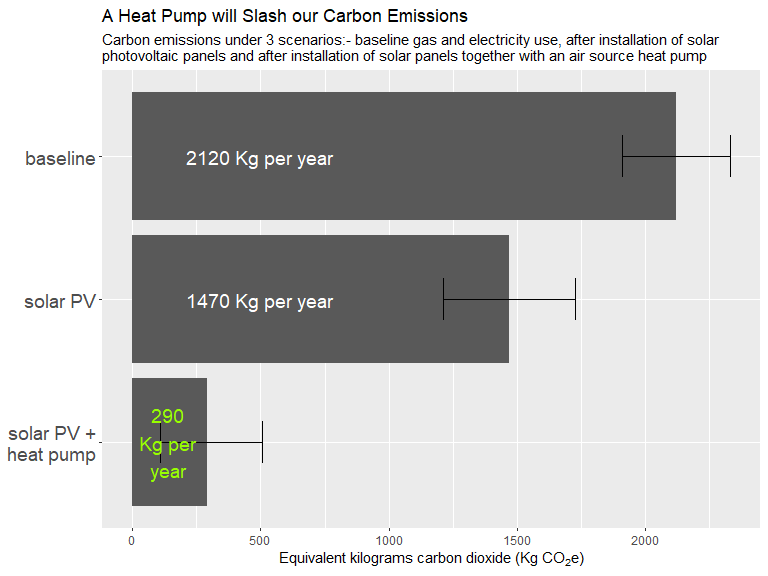
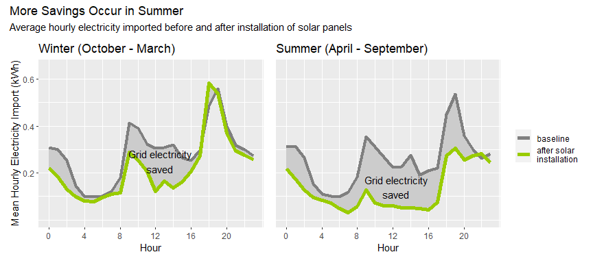
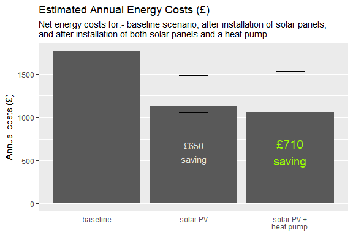

The Road to Carbon Zero - Starting at Home
================

> It’s no secret we need to cut carbon emissions. This repo contains
> files from an analysis of our household gas and electricity usage with
> the following questions in mind:-

1.  What are the potential carbon savings associated with the
    installation of solar panels and an air source heat pump?

2.  What would be the impact on net annual energy costs?

3.  What would be the main factors affecting our energy bill?

Main points are below. See other files for data preparation and full
analysis. Figures correct as of July 2023.

------------------------------------------------------------------------

# Carbon Savings

The equivalent kilograms of carbon dioxide emissions due to our annual
household energy use was calculated under three scenarios:-

- Baseline (our typical annual usage of electricity and gas before any
  changes. We have a 3 bed semi, gas combi boiler and EPC rating “B”)  
- After installation of solar panels (expected generated energy treated
  as zero carbon and deducted from overall emissions)  
- After installation of both solar panels and an air source heat pump to
  supply all our heating needs (zero gas requirement, extra electricity
  required to run the heat pump)

<!-- -->

Solar panels will save around 650 Kg CO2e per year. If we get
a heat pump too we could bring our carbon emissions from domestic energy
usage to under 300 Kg CO2e per year - that’s nearly 2 tonnes
saved!

OK, so what about the financial cost…

# Annual costs

### After installation of solar panels

Calculating how much solar panels will save us depends a lot on how we
use electricity. Electricity import costs (currently 31.1p/kwh) are much
higher than the price we are paid for exporting electricity to the grid
(15p/kWh on our current tariff).

Unfortunately peak usage does not always occur in generation hours.

<!-- -->

The figure shows the change in typical electricity imported from the
grid before and after installing solar panels. The shaded area is the
difference and represents our saving. In summer, with longer daylight
hours, we need less grid electricity due to more access to solar
generated energy.

We are currently using about 24% of our generated electricity which is a
35% reduction in electricity imported from the grid.

This equates to an annual cost saving of about £650 which would give us
a 9 year pay back for the cost of solar install.

### Solar panels and an air source heat pump

<!-- -->

Assuming we come off gas completely and save on the gas annual standing
charge I estimate our annual savings from heat pump and solar panels
could be about £710.

This would mean the cost of installing both the solar panels and heat
pump would be paid back in about 15 years.

**Note these figures are only a very rough guideline.** Savings will
depend on the actual export rate (SEG), efficiency of the heat pump
(characterised by the seasonal coefficient of performance or SCOP),
annual yield from the solar panels and the amount of generated
electricity used locally. The range shown on the plot relates to likely
variations in these. The relative price of electricity and gas will also
have an effect. If the price of gas increases relative to electricity
then savings will be increased and payback time will drop so a heat pump
will be more favourable.

# Factors affecting net annual energy costs

| factor                        |    best |   worst | annual_cost_difference |
|:------------------------------|--------:|--------:|-----------------------:|
| export rate (£/KWh)           |    0.15 |    0.03 |                    270 |
| SCOP                          |    3.70 |    2.90 |                    200 |
| annual yield (KWh)            | 3657.00 | 3189.00 |                    100 |
| solar energy used locally (%) |    0.42 |    0.28 |                     80 |

Factors affecting energy costs with solar panels and a heat pump
installed, likely ranges and possible impact on net annual costs (£)

The most significant factor affecting ROI was found to be the electric
export rate which can vary by provider between about 3p to 15p per KWh.
Switching [SEG
provider](https://www.theecoexperts.co.uk/solar-panels/smart-export-guarantee#link-smart-export-guarantee-rates)
could result in £270 savings. Future variations in electric import rates
will naturally also have a strong effect though they are currently
capped. A heat pump will become more favourable if electricity prices
are reduced relative to gas and vice versa.

Heat pump efficiency has a strong impact on annual running costs. A SCOP
of 3.7 will yield £200 more savings compared to one of 2.9. This can be
controlled to some extent by heat pump settings - eg running at a lower
temperature.

Most of our anticipated cost savings come from the solar panels. Of
course, if the gas boiler needs replacing anyway, payback time for the
heat pump is not really the issue.

# Conclusions

- A heat pump and solar panels will slash our carbon emissions from
  domestic energy usage by nearly 2 tonnes. It”s a huge step on our
  route to carbon zero.
- Our existing solar panels with current patterns of usage will pay for
  themselves in about 9 years.
- It is uncertain if a heat pump installation will pay for itself, on
  its own. However in combination with solar PV the combined
  installation costs could be paid off in 15 years. This could vary
  considerably dependent on tariff and heat pump efficiency. Financial
  return on investment is not guaranteed.
